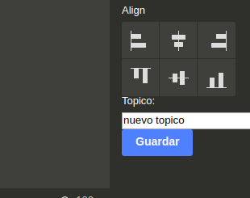
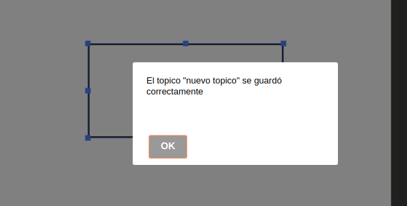
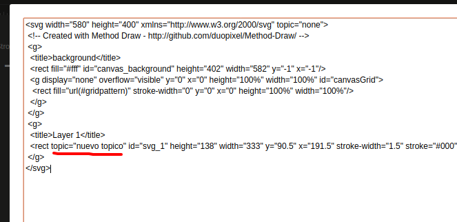
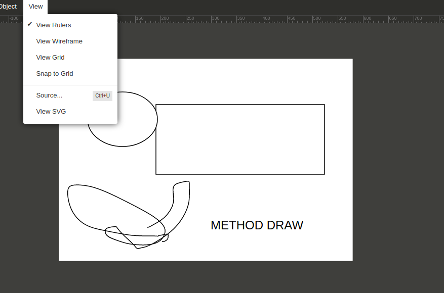
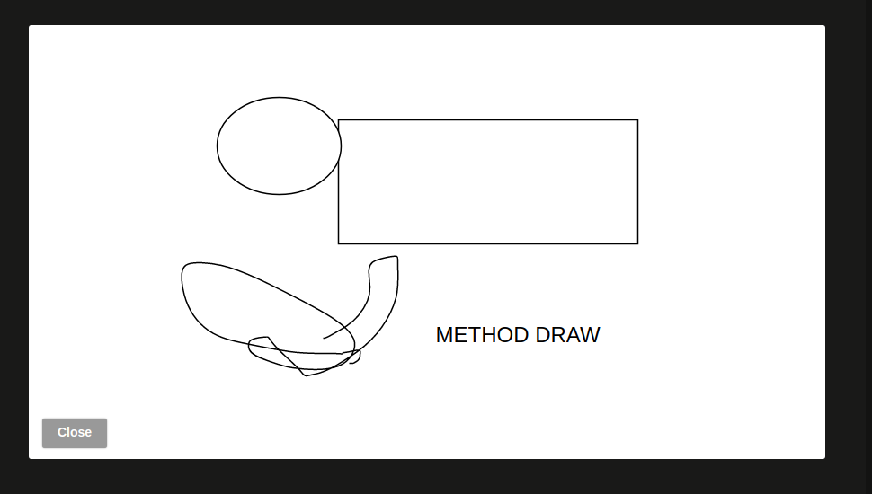

# TNT - Method Draw

Implementación de funciones utilizando como base el editor Method Draw forkeado de: 
https://github.com/duopixel/Method-Draw


Las implementaciónes se realizaron para el examen final de la materia de Taller de Nuevas Tecnologias 2018 durante el mes de julio del corriente año.


## Despliegue

Abrir en el navegador el archivo: `editor/index.html`


## Consigna

La consigna a resolver es la siguiente:

```
En base a un editor de SVG basado en HTML y EcmaScript deberá agregar la capacidad de definir atributos del tipo tópico.
Deberá ser posible poder pre-visualizar los SVG editados en un marco(iframe), conectado al broker MQTT. Se sugiere utilizar SVG Edit o Method Draw.
```

Se eligio Method Draw por su simplicidad a diferencia de SVG Edit cuya estructura es mas compleja.

### Definición de Topicos

Un tópico es una cadena UTF-8 que usa el Broker para filtrar mensajes para cada cliente conectado.
Para esta característica, se incorporo un campo de texto en la barra lateral derecha que incluye su correspondiente botón de guardado, este campo de texto solo aparece al seleccionar una figura del canvas y permite agregar un atributo TOPIC en el svg con el valor ingresado en el campo de texto.




Al presionar "Guardar" se mostrará un aviso indicando que el tópico se guardo correctamente.





Si uno observa el svg en formato crudo (haciendo click en View -> Source en el editor), se puede ver el tópico agregado.



Puede agregar tantas figuras con tópicos diferentes como se necesite, pero solo se permite un unico tópico por figura.


### Pre visualización de los SVG editados

Para previsualizar el SVG, simplemente seleccione la opción en View -> View SVG en el menu superior del editor.







## Copyright y Creditos

Method Draw is Copyright (c)
Mark MacKay mark@method.ac

Published under an MIT License. Enjoy.

Based on SVG Edit:
https://github.com/SVG-Edit/svgedit

SVG Edit is Copyright (c)
Narendra Sisodiya <narendra.sisodiya@gmail.com>
Pavol Rusnak <rusnakp@gmail.com>
Jeff Schiller <codedread@gmail.com>
Vidar Hokstad <vidar.hokstad@gmail.com>
Alexis Deveria <adeveria@gmail.com>